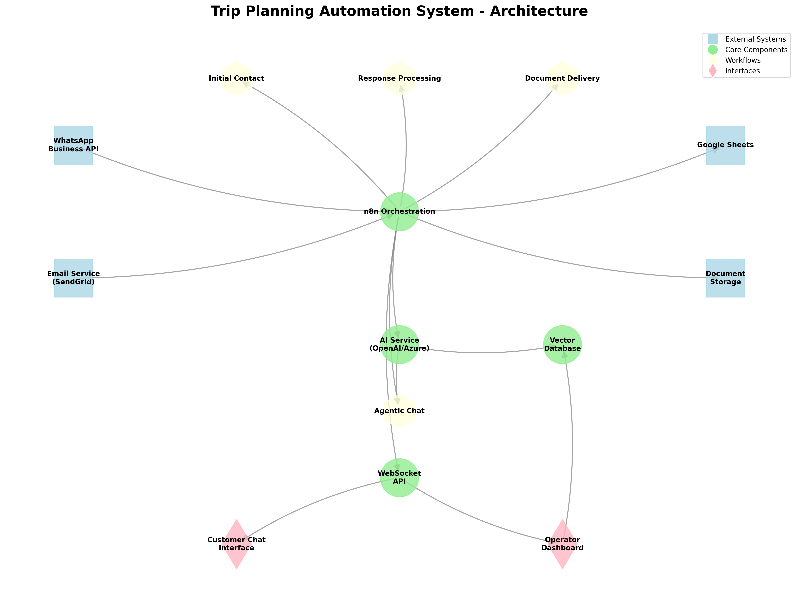

# Trip Planning Automation System: User Guide

## What We're Building

We're creating an automated system that will help your travel planning company reach out to 50,000+ potential customers efficiently, respond to their interests, and provide helpful information through both email and WhatsApp.

### The Problem We're Solving

Managing outreach to thousands of potential customers manually is:
- Time-consuming and error-prone
- Difficult to personalize at scale
- Hard to track and follow up consistently
- Challenging to provide timely responses to inquiries

### Our Solution

Our automated system will:
1. **Send personalized initial messages** to your prospects through their preferred channels
2. **Automatically classify responses** into "Yes," "No," or "Maybe" categories
3. **Send relevant travel documents** to interested customers
4. **Remove uninterested customers** from future communications
5. **Follow up with undecided customers** in a timely manner
6. **Answer common questions automatically** using AI-powered chat
7. **Provide human agents** with context when needed for complex inquiries
8. **Track all interactions** in a centralized database
9. **Generate analytics** on campaign performance

## How It Works

### Step 1: Initial Outreach
- System sends personalized emails and WhatsApp messages to your customer list
- Messages include a clear call-to-action asking about travel interest
- All messages are tracked in a central database

### Step 2: Response Processing
- When customers reply, the system automatically categorizes their responses
- "Yes" responses trigger document delivery
- "No" responses are marked for removal
- "Maybe" responses are flagged for follow-up
- Unclear responses are sent to human operators for review

### Step 3: Automated Follow-ups
- Interested customers receive travel brochures, itineraries, and pricing information
- Undecided customers receive scheduled follow-up messages with additional information
- All interactions are tracked and available for review by your team

### Step 4: Intelligent Chat Support
- Customers can ask questions via email or WhatsApp
- AI-powered system analyzes the questions and provides accurate, helpful responses
- Complex queries are routed to human agents with full conversation context
- Customer preferences and history are used to personalize responses

### Step 5: Analytics & Optimization
- System tracks open rates, response rates, and conversion metrics
- A/B testing capability helps optimize message effectiveness
- Daily reports show campaign performance and customer engagement
- Insights help refine targeting and messaging for future outreach

## Benefits

1. **Massive Time Savings** - Automate repetitive tasks that would take hundreds of hours manually
2. **Increased Conversion Rates** - Timely, personalized responses improve customer conversion
3. **Consistent Experience** - Every customer receives the same high-quality attention
4. **Better Insights** - Detailed analytics on what works and what doesn't
5. **Scalability** - Easily handle 50,000+ contacts without adding staff
6. **24/7 Availability** - Automated responses don't take holidays or sleep
7. **Reduced Costs** - Lower operational costs compared to manual outreach

## Timeline

We'll implement this entire system in just 8 days (April 16-23), with:
- First 2 days: Setting up infrastructure and initial outreach
- Middle 3 days: Building response handling and document delivery
- Final 3 days: Adding AI chat, analytics, and optimizing performance

## Getting Started

Once the system is deployed on April 23, your team will:
1. Access a simple dashboard to monitor all campaigns
2. View real-time analytics on customer responses
3. Receive notifications when human intervention is needed
4. Be able to manually review and override automated decisions if needed

No technical expertise is required to operate the system - we've designed it to be user-friendly for your marketing and customer service teams.

## What Makes This System Special

Unlike generic marketing automation tools, our system is:
- **Multi-channel** - Works across email and WhatsApp seamlessly
- **Intelligent** - Uses AI to understand customer intent and provide helpful responses
- **Integrated** - All customer data is centralized and accessible
- **Customized** - Built specifically for travel industry needs and your company's workflows
- **Scalable** - Designed to handle 50,000+ contacts without performance issues 